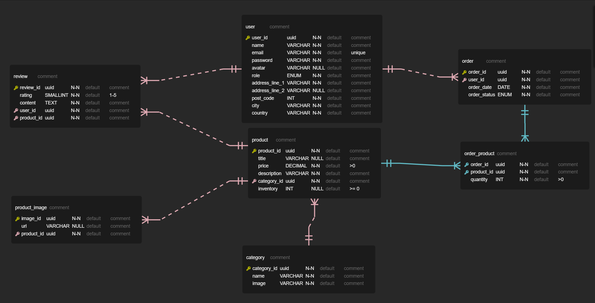

# Fullstack Project


This project was done as a final project of the Full Stack Program at [Integrify](https://www.integrify.io/). It reflects the functionalities of a typical e-commerce application. The data is fetched and can be created, deleted, updated from an API which is running on ASP.NET Core. The application comes with an authentication system with defined roles for users. Guests can interact with the products by filtering, searching, sorting, or adding, removing them from their cart. Register as a customer allows you to place an order, manage your order history, posting a review on a product. While the admin can perform CRUD operations on the products, users and all the orders in their own dashboard.

- Frontend: SASS, TypeScript, React, Material-UI, Redux Toolkit
- Backend: ASP.NET Core, Entity Framework Core, PostgreSQL
- Testing: Jest for frontend and XUnit, Moq for backend
- Deployment: Netlify for frontend and Azure, ElephantSQL for backend

## Table of Contents

1. [Technologies](#technologies)
2. [Project Structure](#project-structure)
3. [Tables Relationship](#tables-relationship)
4. [Project Architecture](#project-architecture)
5. [API Endpoints](#api-endpoints)
6. [Features and User Interface](#features-and-user-interface)
7. [Getting Started](#getting-started)

## Technologies

- **Frontend**: SASS, TypeScript, React, Material-UI, Redux Toolkit
- **Backend**: ASP.NET Core, Entity Framework Core, PostgreSQL
- **Testing**: Jest for frontend and XUnit, Moq for backend
- **Deployment**: Netlify for frontend and Azure, ElephantSQL for backend

## Project Structure

- **Frontend**:

src/
┣ components/
┃ ┣ AddressForm.tsx
┃ ┣ AppPagination.tsx
┃ ┣ CardsContainer.tsx
┃ ┣ Cart.tsx
┃ ┣ CategorySlide.tsx
┃ ┣ DarkToggleMode.tsx
┃ ┣ FiltersContainer.tsx
┃ ┣ Footer.tsx
┃ ┣ ImageLinkGenerator.tsx
┃ ┣ ItemInCart.tsx
┃ ┣ NavBar.tsx
┃ ┣ OrderHistoryUser.tsx
┃ ┣ PasswordChangeForm.tsx
┃ ┣ PaymentForm.tsx
┃ ┣ ProductCard.tsx
┃ ┣ ProductDetailsCard.tsx
┃ ┣ ProductForm.tsx
┃ ┣ ProductsLimiter.tsx
┃ ┣ ProductsSorter.tsx
┃ ┣ ProductsTable.tsx
┃ ┣ ReviewCard.tsx
┃ ┣ ReviewForm.tsx
┃ ┣ ReviewOrder.tsx
┃ ┣ SearchBox.tsx
┃ ┣ UpdateCurrentUserForm.tsx
┃ ┣ UpdateUserForm.tsx
┃ ┗ UsersTable.tsx
┣ hooks/
┃ ┣ useAppDispatch.ts
┃ ┗ useAppSelector.ts
┣ interfaces/
┃ ┣ AddressFormInput.ts
┃ ┣ CartItem.ts
┃ ┣ Category.ts
┃ ┣ CreateProductInput.ts
┃ ┣ GoogleProfile.ts
┃ ┣ Order.ts
┃ ┣ OrderInput.ts
┃ ┣ OrderProduct.ts
┃ ┣ OrderProductInput.ts
┃ ┣ PaginationQuery.ts
┃ ┣ PasswordChangeInput.ts
┃ ┣ PaymentFormInput.ts
┃ ┣ Product.ts
┃ ┣ ProductImage.ts
┃ ┣ ProductImageCreate.ts
┃ ┣ ProductInputForm.ts
┃ ┣ Review.ts
┃ ┣ UpdateOrderInput.ts
┃ ┣ UpdateProductInput.ts
┃ ┣ UpdateUserInput.ts
┃ ┣ UpdateUserRoleInput.ts
┃ ┣ User.ts
┃ ┣ UserCredentials.ts
┃ ┣ UserRegisterInput.ts
┃ ┗ UsersReducerState.ts
┣ pages/
┃ ┣ CheckOut.tsx
┃ ┣ ErrorPage.tsx
┃ ┣ Home.tsx
┃ ┣ Login.tsx
┃ ┣ OrderDashboard.tsx
┃ ┣ ProductDashboard.tsx
┃ ┣ ProductDetails.tsx
┃ ┣ Products.tsx
┃ ┣ ProductsByCategory.tsx
┃ ┣ Profile.tsx
┃ ┣ Register.tsx
┃ ┣ Root.tsx
┃ ┗ UserDashboard.tsx
┣ redux/
┃ ┣ reducers/
┃ ┃ ┣ cartReducer.ts
┃ ┃ ┣ categoriesReducer.ts
┃ ┃ ┣ ordersReducer.ts
┃ ┃ ┣ productsReducers.ts
┃ ┃ ┗ usersReducer.ts
┃ ┗ store.ts
┣ test/
┃ ┣ data/
┃ ┃ ┣ cartData.ts
┃ ┃ ┣ categoriesData.ts
┃ ┃ ┣ productsData.ts
┃ ┃ ┗ usersData.ts
┃ ┣ redux/
┃ ┃ ┣ cartReducer.test.ts
┃ ┃ ┣ categoriesReducer.test.ts
┃ ┃ ┣ productsReducer.test.ts
┃ ┃ ┗ usersReducer.test.ts
┃ ┗ shared/
┃   ┣ categoryServer.ts
┃   ┣ productServer.ts
┃   ┗ userServer.ts
┣ utils/
┃ ┣ CheckAdmin.tsx
┃ ┗ CheckAuth.tsx
┣ App.tsx
┣ index.css
┣ index.tsx
┣ react-app-env.d.ts
┣ reportWebVitals.ts
┣ setupTests.ts
┗ ThemeProvider.tsx

- **Backend**:

Walmad.Business/
┣ src/
┃ ┣ Abstraction/
┃ ┃ ┣ IAuthService.cs
┃ ┃ ┣ IBaseService.cs
┃ ┃ ┣ ICategoryService.cs
┃ ┃ ┣ IOrderService.cs
┃ ┃ ┣ IProductImageService.cs
┃ ┃ ┣ IProductService.cs
┃ ┃ ┣ IReviewService.cs
┃ ┃ ┣ ITokenService.cs
┃ ┃ ┗ IUserService.cs
┃ ┣ DTO/
┃ ┃ ┣ CategoryDTO.cs
┃ ┃ ┣ OrderDTO.cs
┃ ┃ ┣ OrderProductDTO.cs
┃ ┃ ┣ ProductDTO.cs
┃ ┃ ┣ ProductImageDTO.cs
┃ ┃ ┣ ReviewDTO.cs
┃ ┃ ┗ UserDTO.cs
┃ ┣ Service/
┃ ┃ ┣ AuthService.cs
┃ ┃ ┣ BaseService.cs
┃ ┃ ┣ CategoryService.cs
┃ ┃ ┣ OrderService.cs
┃ ┃ ┣ ProductImageService.cs
┃ ┃ ┣ ProductService.cs
┃ ┃ ┣ ReviewService.cs
┃ ┃ ┗ UserService.cs
┃ ┗ Shared/
┃   ┣ CustomExeption.cs
┃   ┣ MapperProfile.cs
┃   ┗ PasswordService.cs
┗ Walmad.Business.csproj

Walmad.Controller/
┣ src/
┃ ┗ Controller/
┃   ┣ AuthController.cs
┃   ┣ BaseController.cs
┃   ┣ CategoryController.cs
┃   ┣ OrderController.cs
┃   ┣ ProductController.cs
┃   ┣ ProductImageController.cs
┃   ┣ ReviewController.cs
┃   ┗ UserController.cs
┗ Walmad.Controller.csproj

Walmad.Core/
┣ src/
┃ ┣ Abstraction/
┃ ┃ ┣ IBaseRepo.cs
┃ ┃ ┣ ICategoryRepo.cs
┃ ┃ ┣ IOrderRepo.cs
┃ ┃ ┣ IProductImageRepo.cs
┃ ┃ ┣ IProductRepo.cs
┃ ┃ ┣ IReviewRepo.cs
┃ ┃ ┗ IUserRepo.cs
┃ ┣ Entity/
┃ ┃ ┣ BaseEntity.cs
┃ ┃ ┣ Category.cs
┃ ┃ ┣ Order.cs
┃ ┃ ┣ OrderProduct.cs
┃ ┃ ┣ Product.cs
┃ ┃ ┣ ProductImage.cs
┃ ┃ ┣ Review.cs
┃ ┃ ┣ Timestamp.cs
┃ ┃ ┗ User.cs
┃ ┗ Parameter/
┃   ┣ Credentials.cs
┃   ┣ GetAllParams.cs
┃   ┗ PasswordChangeForm.cs
┗ Walmad.Core.csproj

Walmad.WebAPI/
┣ src/
┃ ┣ Authorization/
┃ ┃ ┣ AdminOrOwnerAccountHandler.cs
┃ ┃ ┣ AdminOrOwnerOrderHandler.cs
┃ ┃ ┗ AdminOrOwnerReviewHandler.cs
┃ ┣ Database/
┃ ┃ ┣ DatabaseContext.cs
┃ ┃ ┣ SeedingData.cs
┃ ┃ ┗ TimestampInterceptor.cs
┃ ┣ Middleware/
┃ ┃ ┗ ExceptionHandlerMiddleware.cs
┃ ┣ Repository/
┃ ┃ ┣ BaseRepo.cs
┃ ┃ ┣ CategoryRepo.cs
┃ ┃ ┣ OrderRepo.cs
┃ ┃ ┣ ProductImageRepo.cs
┃ ┃ ┣ ProductRepo.cs
┃ ┃ ┣ ReviewRepo.cs
┃ ┃ ┗ UserRepo.cs
┃ ┣ Service/
┃ ┃ ┗ TokenService.cs
┃ ┗ Program.cs
┣ appsettings.Development.json
┣ appsettings.json
┗ Walmad.WebAPI.csproj

Walmad.Test/
┣ src/
┃ ┣ AuthServiceTest.cs
┃ ┣ CategoryServiceTest.cs
┃ ┣ OrderServiceTest.cs
┃ ┣ ProductServiceTest.cs
┃ ┣ ReviewServiceTest.cs
┃ ┗ UserServiceTest.cs
┣ GlobalUsings.cs
┗ Walmad.Test.csproj

## Tables Relationship

All the data is stored and retrieved using PostgreSQL, a free and open-source relational database management system. Below is an entity relationship diagram which demonstrates all the tables and the relationship between them



## Project Architecture

The backend of the application is built and complied with the Clean Architecture. The codes are divided into 4 layers:

- **Core**: This layer represents the core business entities or models in the application. These entities are completely independent from any framework or technology.

- **Business**: This layer defines the application's services and the interactions between entities. This is also where data validation and transformation happens

- **Controller**: This layer lays out all the endpoints and their authorization, authentication rules to all the services.

- **Web API**: The outermost layer consists of external frameworks, tools, and delivery mechanisms such as the ASP.NET framework itself. This layer also hosts all the repositories which each connect to their own tables in the database.

## API Endpoints

All the endpoints of the API are documented and can be tested directly on the generated Swagger page. From there you can view each endpoint URL, their HTTP methods, request body structures and authorization requirements. Access the Swagger page from [this link](https://walmad.azurewebsites.net/)


## Features and User Interface

A video demonstrating the user interface of the frontend and all the features can be found [here](https://drive.google.com/file/d/12Q2vkRvCgv95tVxH42oIT23RlJG9mvaX/view?usp=sharing)

## Getting Started

1. Open your terminal and clone the front-end repository with the following command: 
```
git clone https://github.com/tduyphat/fs16_6-frontend-project
```

2. Next, clone the back-end repository: 
```
git clone https://github.com/tduyphat/fs16_CSharp-FullStack
```

3. Navigate the Web API layer in the back-end directory, in the `appsettings.json`, add these values:

```
"ConnectionStrings": {
    "LocalDb": <YOUR_LOCAL_DB>
    "RemoteDb": <YOUR_REMOTE_DB>
  },
"Jwt":
{
  "Issuer": "John Doe",
  "Audience": "E-Commerce",
  "Key": "secret-key"
}
```

The application is currently using `RemoteDb` value to connect to an external database. See this [documentation]("https://www.elephantsql.com/docs/index.html") on ElephantSQL to see how you can obtain a connect string.

4. If there is already a folder `Migrations` in the Web API layer, delete it. Run this command to create a new `Migrations` folder, which stores the snapshot of all the database context changes:

```
dotnet ef migrations add Create
```

5. Apply all the changes to the database

```
dotnet ef database update
```

6. In the WebAPI layer, start the backend in your local machine:

```
dotnet watch
```

7. In the front-end directory, create a file called `.env` in the root of the project. Add this value: `REACT_APP_API_URL = "http://localhost:5258/"` (the host number could be different). If you want to use the Google Sign In feature in your local machine create this value: `REACT_APP_CLIENT_ID = "<YOUR_CLIENT_ID>"`. Check out this [documentation](https://support.google.com/googleapi/answer/6158849?hl=en) to see how you can obtain a client ID from Google.

8. Install all the packages in the front-end:

```
npm install
```

9. Start the front-end in your local machine:

```
npm start
``` 

5. Or simply access the deployed version on Netlify from this [link](https://phat-tran-walmad.netlify.app/).


